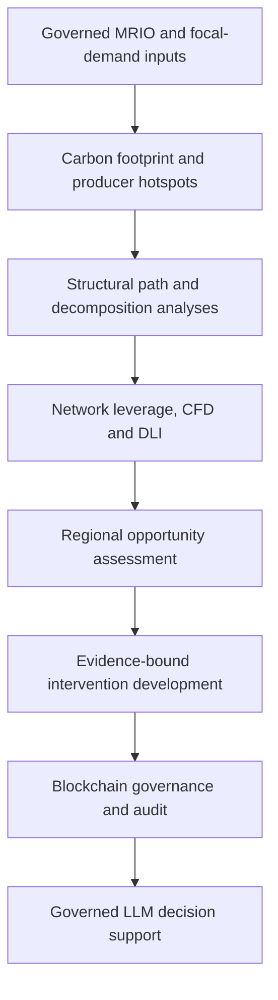

# AURORA: MRIO Supply-Chain Decarbonization Using Blockchain and LLM

AURORA is a research-grade strategic carbon intelligence and governance framework for low-carbon supply chains. It integrates environmentally extended multi-regional input-output (EE-MRIO) analysis, structural path analysis (SPA), structural decomposition analysis (SDA), network leverage analysis, CRITIC-weighted Dependency Leverage Index (DLI), regional opportunity assessment, evidence-bound intervention development, blockchain-enabled governance, and local LLM decision support.

This repository contains the validated AURORA source and deployment package developed for the accompanying research study.

> **Research prototype:** This software is intended for reproducible research, methodological evaluation, and controlled local demonstrations. It is not a production blockchain, identity-management, or credential-management system.

## Framework workflow



## Main capabilities

- Focal-company carbon-footprint accounting using two-period EE-MRIO data.
- Producer-origin emissions hotspot identification.
- Dynamically bounded SPA reporting covering at least 87% of the complete focal-company footprint.
- Company-, producer-node-, and union-path-level four-factor SDA.
- Network analysis using betweenness centrality, PageRank, Carbon Footprint Dependency, and intervention criticality.
- Objective pooled Pearson-CRITIC weighting and two-period DLI assessment.
- Regional opportunity assessment using structural, market, carbon, linkage, Pareto, and temporal-evidence gates.
- Deterministic mapping from analytical evidence to intervention mechanisms.
- Explicit stakeholder recording of actionability and pair-specific technical feasibility.
- Evidence-bound conservative, expected, and ambitious prospective-abatement scenarios.
- Formal Oracle verification and separate human approval or rejection.
- Post-implementation monitoring without overwriting the original prospective scenario.
- Four role-aware Solidity contracts and content-addressed evidence records.
- A locally hosted LLM assistant that retrieves and explains governed evidence while leaving deterministic calculations authoritative.
- Publication-readable analytical plots and complete results exports.

## Terminology alignment

| Public/paper term | Legacy implementation identifier | Meaning |
| --- | --- | --- |
| AURORA | `AURORA` | AURORA names the complete strategic carbon intelligence and governance framework. Some retained internal identifiers use `aurora` for the regional-opportunity component; those identifiers remain unchanged to preserve validated artifact compatibility. |
| Carbon Footprint Dependency (CFD) | `CDR` in legacy fields, modules, and stored artifacts | Dimensionless complete-node-removal dependency measure used as one DLI criterion. Public reporting uses CFD. |
| Dependency Leverage Index (DLI) | `DLI` | CRITIC-weighted composite of normalized network and dependency criteria. It is not an emissions or abatement quantity. |

## Repository structure

```text
.
├── README.md
├── platform/
│   ├── contracts/
│   ├── streamlit_app/
│   ├── tests/
│   ├── assurance_history/
│   ├── BUILD_MANIFEST_SHA256.txt
│   ├── requirements.txt
│   ├── package.json
│   ├── UPLOAD_INPUTS_GUIDE.txt
│   └── start_dapp_lifecycle.ps1
└── .github/workflows/validate.yml
```

The GitHub release archive preserves the original validated `DEPLOY_FINAL` directory. A repository clone stores the same deployment files under `platform`.

## System requirements

The validated end-to-end deployment targets Windows 10/11 with PowerShell.

Install:

- Python 3.10 or newer
- Node.js 18–24 with npm
- Git
- Ollama
- A current web browser

The default local model is `qwen3:4b`. Initial installation requires internet access to download Python packages, npm packages, and the Ollama model.

Verify the prerequisites in PowerShell:

```powershell
python --version
node --version
npm --version
git --version
ollama --version
```

## Clone the repository

```powershell
Set-Location "$env:USERPROFILE\Documents"
git clone https://github.com/PratyushKumarPatro/MRIO-Supply-Chain-Decarbonization-using-Blockchain-and-LLM.git
Set-Location .\MRIO-Supply-Chain-Decarbonization-using-Blockchain-and-LLM\platform
```

## Install and test

Run these commands from the `platform` directory:

```powershell
python -m venv .venv
.\.venv\Scripts\python.exe -m pip install --upgrade pip
.\.venv\Scripts\python.exe -m pip install -r .\requirements.txt -r .\streamlit_app\requirements.txt
.\.venv\Scripts\python.exe -m pip check

npm ci
npm run compile
npm run validate:contract

.\.venv\Scripts\python.exe -m unittest discover -v
.\.venv\Scripts\python.exe -m compileall -q .
```

Expected validation gates:

- `pip check` reports no incompatible requirements.
- Solidity compilation uses `solc 0.8.19`, optimizer runs `200`, and the Paris EVM target.
- `npm run validate:contract` exits successfully.
- The Python regression suite reports `Ran 255 tests` and `OK` for this release.
- Python bytecode compilation exits successfully without errors.

Do not proceed to the live deployment if compilation, contract validation, or the regression battery fails.

## Start the platform

Pull the default local language model:

```powershell
ollama pull qwen3:4b
```

Confirm that Ollama is available:

```powershell
Invoke-RestMethod -Uri http://127.0.0.1:11434/api/tags -Method Get
```

Start a clean Ganache blockchain in the first PowerShell window:

```powershell
npx ganache -p 8545 --wallet.totalAccounts 10
```

Leave Ganache running. Open a second PowerShell window, return to the platform directory, and launch a fresh lifecycle:

```powershell
Set-Location "$env:USERPROFILE\Documents\MRIO-Supply-Chain-Decarbonization-using-Blockchain-and-LLM\platform"
powershell.exe -NoLogo -NoProfile -ExecutionPolicy Bypass -File .\start_dapp_lifecycle.ps1 -Reset
```

The `-Reset` option is mandatory for a clean validation deployment. It prevents old contract addresses, runtime evidence, input bindings, or cached results from being reused.

Local services:

| Service | Address |
| --- | --- |
| AURORA Streamlit interface | <http://127.0.0.1:8501> |
| Data Orchestrator health endpoint | <http://127.0.0.1:8765/health> |
| Ganache JSON-RPC | <http://127.0.0.1:8545> |
| Ollama | <http://127.0.0.1:11434> |

Check the Data Orchestrator independently:

```powershell
Invoke-RestMethod -Uri http://127.0.0.1:8765/health -Method Get | ConvertTo-Json -Depth 8
```

## Required research inputs

Operational MRIO and focal-company workbooks are intentionally excluded from the public repository.

### EE-MRIO workbook

The `.xlsx` workbook must:

- contain sheets named `2014`, `2017`, and `Metadata`;
- contain exactly 455 unique nodes in a consistent order;
- provide the aligned transaction, total-output, final-demand, and emissions information required by the validator;
- reconstruct the Leontief system and emissions identity within the implemented validation tolerances; and
- use million USD for MRIO monetary values and Mt CO2 for the direct-emissions extension.

### Focal-company demand workbook

The `.xlsx` workbook must contain a `Converted_Demand` sheet with these columns:

```text
Node_Code
Company_2014_USD
Company_2017_USD
```

It must contain exactly 455 rows in the same `Node_Code` order as the active MRIO metadata. Focal-company demand is entered in ordinary USD, and resulting focal-company carbon values are reported in t CO2. The framework performs no hidden numerical rescaling.

See `platform/UPLOAD_INPUTS_GUIDE.txt` and `platform/UNIT_CONSISTENCY_NO_RESCALING_GUIDE.txt` for the authoritative validation and unit rules.

## Guided analytical and governance sequence

Use the **Governance & Audit Control** page and complete the lifecycle in order:

1. Register the regulatory authority, focal company, MRIO data provider, and four Oracle roles.
2. Deploy the Registration smart contract.
3. Upload, validate, request, fulfil, and promote the MRIO workbook.
4. Upload, validate, request, fulfil, and promote the focal-company demand workbook.
5. Complete focal-company carbon accounting and producer-origin hotspot analysis.
6. Complete bounded SPA for 2014 and 2017.
7. Complete company-, node-, and path-level SDA.
8. Run Network/DLI for 2014 first and then 2017. The 2017 fulfilment creates the authoritative pooled two-period Pearson-CRITIC evidence.
9. Complete the 2017 regional opportunity assessment.
10. On the Blockchain and LLM-based System page, compute intervention evidence and candidate mappings.
11. Select a producer hotspot and linked leverage node and inspect the deterministic driver-to-mechanism mapping.
12. Record node-level actionability and pair-specific technical feasibility.
13. Either quantify a conservative/expected/ambitious scenario with documented evidence, coverage, adoption, confidence, and limitations, or explicitly document why quantification is not defensible.
14. Generate governance-ready options and select one for Oracle verification.
15. Record a separate authorized human approval or rejection.
16. Open final LLM decision support only after the intervention-governance branch is resolved.
17. For an approved and implemented intervention, append like-for-like monitored performance evidence without overwriting the original scenario.

The Intervention Governance sidebar is a read-only results, comparison, provenance, and download surface. State-changing operations remain on the Blockchain and LLM-based System page.

## Live runtime validation

After Query Management is deployed and all services are running, execute:

```powershell
.\.venv\Scripts\python.exe .\validate_runtime_methodology.py --output .\runtime_methodology_validation.json
```

Do not report the deployed methodology as verified if this audit fails. It checks active inputs, deployed contract identities, temporal Network/DLI evidence, regional-opportunity binding, intervention-governance resolution, content hashes, and final-query readiness.

## Example LLM validation prompts

Use these prompts only after the governed analytical and intervention lifecycle has been completed. Replace bracketed identifiers with values shown in the interface.

```text
What is the focal-company carbon footprint in 2017, and what governed evidence supports the value?
```

```text
Explain why [node_code] can have a high DLI even when it is not a major producer-origin emissions hotspot.
```

```text
For [node_code], distinguish the primary adverse node-SDA driver from the supporting path-SDA evidence.
```

```text
Summarize the evidence chain for intervention [intervention_id], including actionability, feasibility, scenario status, Oracle verification, and human decision.
```

```text
Distinguish the baseline hotspot footprint, structurally associated footprint, scenario-abatement range, and observed reduction for [intervention_id].
```

Expected behavior:

- Exact numerical answers identify the governed year and evidence source.
- Producer-origin hotspot emissions are not confused with demand-gateway or transmission participation.
- DLI is not reported in t CO2 or interpreted as predicted abatement.
- Regional opportunity evidence is not treated as proof of functional supplier equivalence.
- Prospective scenario estimates are not presented as observed outcomes.
- The assistant does not invent actionability, feasibility, approval, or monitoring evidence.

## Methodological boundaries

- Producer hotspot values are node-level emissions totals.
- In SPA, the left-most node is the focal-demand channel and the right-most node is the emissions-producing endpoint for the reported path.
- CFD and producer-linkage results are structural counterfactual diagnostics, not predicted abatement.
- DLI identifies strategic intervention leverage rather than emissions magnitude.
- SDA explains historical change drivers; it does not forecast intervention performance.
- Regional opportunity evidence does not automatically justify supplier substitution or establish functional equivalence.
- Scenario reductions are assumption-bound comparative estimates, not forecasts or guarantees.
- Observed reduction requires separate, like-for-like post-implementation monitoring evidence.
- Blockchain establishes authorization, integrity, provenance, and process ordering; it does not prove the external truth of an uploaded document.
- The LLM retrieves and explains governed evidence. It cannot recalculate authoritative values, invent feasibility, approve proposals, or alter lifecycle state.

## Clean restart

Stop Streamlit with `Ctrl+C`, close the Ganache window, and start a fresh chain:

```powershell
npx ganache -p 8545 --wallet.totalAccounts 10
```

Then relaunch:

```powershell
powershell.exe -NoLogo -NoProfile -ExecutionPolicy Bypass -File .\start_dapp_lifecycle.ps1 -Reset
```

Do not copy `deployment.json`, `runtime`, `content_store`, `.venv`, `node_modules`, old contract addresses, or operational workbooks between clean release installations.

## Troubleshooting

### Recreate the Python environment

```powershell
Remove-Item -LiteralPath .\.venv -Recurse -Force -ErrorAction SilentlyContinue
python -m venv .venv
.\.venv\Scripts\python.exe -m pip install --upgrade pip
.\.venv\Scripts\python.exe -m pip install -r .\requirements.txt -r .\streamlit_app\requirements.txt
.\.venv\Scripts\python.exe -m pip check
```

### Reinstall and rebuild the Solidity dependencies

```powershell
Remove-Item -LiteralPath .\node_modules -Recurse -Force -ErrorAction SilentlyContinue
npm ci
npm run compile
npm run validate:contract
```

### Inspect local port conflicts

```powershell
Get-NetTCPConnection -State Listen |
    Where-Object LocalPort -In 8501,8545,8765,11434 |
    Select-Object LocalAddress,LocalPort,OwningProcess
```

Stop only a confirmed stale process:

```powershell
Stop-Process -Id <PROCESS_ID>
```

### Inspect Data Orchestrator logs

```powershell
Get-Content .\runtime\orchestrator_stdout.log -Tail 100 -ErrorAction SilentlyContinue
Get-Content .\runtime\orchestrator_stderr.log -Tail 100 -ErrorAction SilentlyContinue
```

### Check the local Ollama model

```powershell
ollama list
ollama pull qwen3:4b
Invoke-RestMethod -Uri http://127.0.0.1:11434/api/tags -Method Get
```

## Security boundary

The supplied Ganache accounts, role bootstrap, local content store, and localhost services are for controlled research evaluation. Do not expose ports `8501`, `8545`, `8765`, or `11434` to untrusted networks. Production use requires governed identities and keys, secure secrets management, access-controlled off-chain storage, an approved blockchain environment, privacy controls, backup and recovery, operational monitoring, and independent security review.

## Validation status

The final deployment archive passed SHA-256 verification. All 255 Python regression tests and Python source compilation passed during publication preparation. The release contains source-matched Solidity artifacts and contract validation records. Users should rerun `npm ci`, `npm run compile`, `npm run validate:contract`, and the complete Python regression battery on the deployment computer.

## Citation and software availability

Repository:

<https://github.com/PratyushKumarPatro/MRIO-Supply-Chain-Decarbonization-using-Blockchain-and-LLM>

Immutable evaluated release:

<https://github.com/PratyushKumarPatro/MRIO-Supply-Chain-Decarbonization-using-Blockchain-and-LLM/releases/tag/v5.0.17>

Suggested paper wording:

> The AURORA framework source code, deployment instructions, validation tests, and immutable v5.0.17 research release are available at https://github.com/PratyushKumarPatro/MRIO-Supply-Chain-Decarbonization-using-Blockchain-and-LLM.
